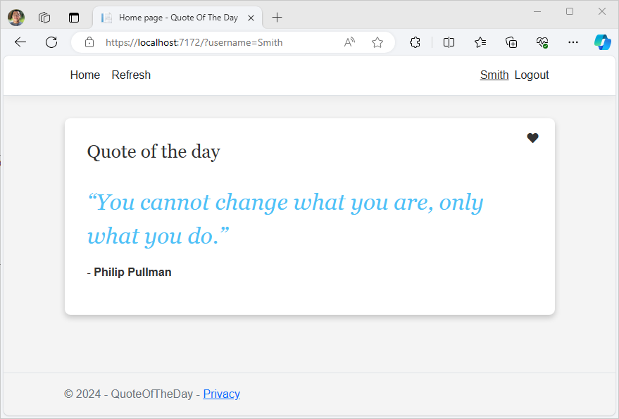
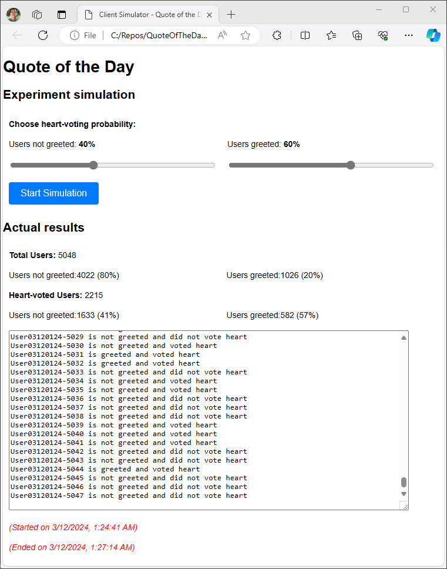
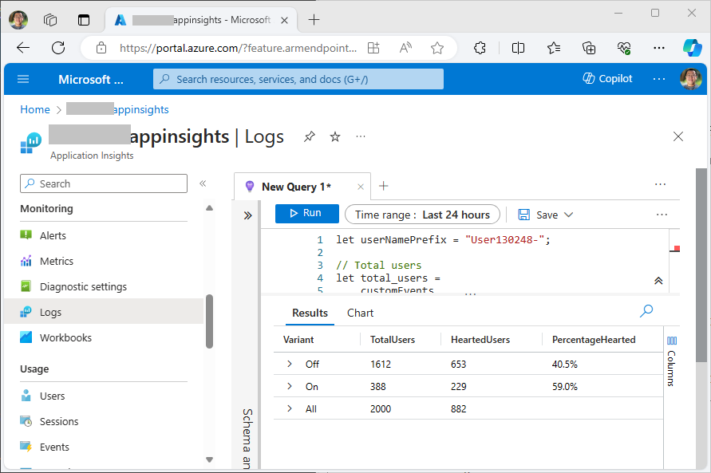
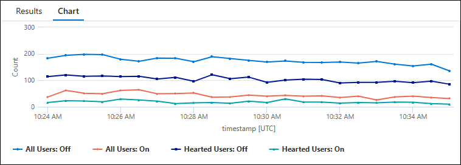

# Quote of the Day

"Quote of the Day" is a .NET 8 application built with ASP.NET Razor pages. It shows a random quote when loaded. A user can heart-vote on the quote. The application is to demonstrate the configuration, feature management, and experimentation capabilities of **Azure App Configuration**.



## Introduction

### Configuration
The application loads quotes from App Configuration, so you can update the quote of the day without redeploying or restarting the application.

### Feature management & experimentation
Instead of the standard title, the application displays a greeting message for certain users based on the targeting rules of a feature flag. The experimentation (aka. A/B testing) is conducted to measure if a personalized greeting message can encourage more user engagement (voting heart).

### Telemetry
After running the application, loging in with different users, and voting for some quotes, You should find *FeatureEvaluation* and *Heart* events as customEvents under the *Logs* balde in your Application Insights.

### How to setup
1. Provision an App Configuration store and an Application Insights instance. Create following environment variables before you run the application.

    ```bash
    AZUREAPPCONFIGURATION_ENDPOINT="The endpoint of your Azure App Configuration"
    APPLICATIONINSIGHTS_CONNECTION_STRING="The connection string of your Application Insights"
    ```

1. Create a key-value to hold the quotes in your App Configuration store, for example:

    | Key | Value | Content-Type |
    | --- | ----- | ------------ |
    | QuoteOfTheDay:Quotes | <pre>[<br>  {<br>    "Quote": "Example quote",<br>    "Author": "Author name"<br>  }<br>]</pre> | application/json |

1. Create a feature flag named **Greeting** (key name: *.appconfig.featureflag/QuoteOfTheDay:Greeting*) with two variants, *On* and *Off*, add allocation rules as you like, and enable telemetry.

## Experimentation simulation

### Run simulation
While the application is running, open *ClientSimulator/ClientSimulator.html* in a browser. Choose desired heart-voting probability and hit the *Start Simulation* button to simulate client traffic. You can stop the simulation anytime. Once done, you can check out the telemetry in Application Insights and validate if they match with your simulation results.



### Review telemetry in Application Insights

Here is an example query you can use to get statistical analysis in Application Insights. 

Replace the `userNamePrefix` with the actual value from your simulation output.

```kusto
let userNamePrefix = "UserDDHHMM-";

// Total users
let total_users =
    customEvents
    | where name == "FeatureEvaluation"
    | where customDimensions.TargetingId startswith userNamePrefix
    | summarize TotalUsers = count() by Variant = tostring(customDimensions.Variant);

// Hearted users
let hearted_users =
    customEvents
    | where name == "FeatureEvaluation"
    | where customDimensions.TargetingId startswith userNamePrefix
    | extend TargetingId = tostring(customDimensions.TargetingId)
    | join kind=inner (
        customEvents
        | where name == "Heart"
        | extend TargetingId = tostring(customDimensions.TargetingId)
    ) on TargetingId
    | summarize HeartedUsers = count() by Variant = tostring(customDimensions.Variant);

// Calculate the percentage of hearted users over total users
let combined_data =
    total_users
    | join kind=leftouter (hearted_users) on Variant
    | extend HeartedUsers = coalesce(HeartedUsers, 0)
    | extend PercentageHearted = strcat(round(HeartedUsers * 100.0 / TotalUsers, 1), "%")
    | project Variant, TotalUsers, HeartedUsers, PercentageHearted;

// Calculate the sum of total users and hearted users of all variants
let total_sum =
    combined_data
    | summarize Variant="All", TotalUsers = sum(TotalUsers), HeartedUsers = sum(HeartedUsers);

// Display the combined data along with the sum of total users and hearted users
combined_data
| union (total_sum)
```

The result looks like this in Application Insights.



You can also view the time chart of your data with the following sample query.

```kusto
let userNamePrefix = "UserDDHHMM-";
let roundTimeSpan = 1m;

// Total users
let total_users =
    customEvents
    | where name == "FeatureEvaluation"
    | where customDimensions.TargetingId startswith userNamePrefix
    | extend Variant = strcat("All Users: ", tostring(customDimensions.Variant))
    | summarize Count = count() by bin(timestamp, roundTimeSpan), Variant;

// Hearted users
let hearted_users =
    customEvents
    | where name == "FeatureEvaluation"
    | where customDimensions.TargetingId startswith userNamePrefix
    | extend TargetingId = tostring(customDimensions.TargetingId)
    | join kind=leftanti (
        customEvents
        | where name == "Heart"
        | extend TargetingId = tostring(customDimensions.TargetingId)
    ) on TargetingId
    | extend Variant = strcat("Hearted Users: ", tostring(customDimensions.Variant))
    | summarize Count = count() by bin(timestamp, roundTimeSpan), Variant;

// Combine total users and hearted users data
total_users
| union hearted_users
| render timechart
```


